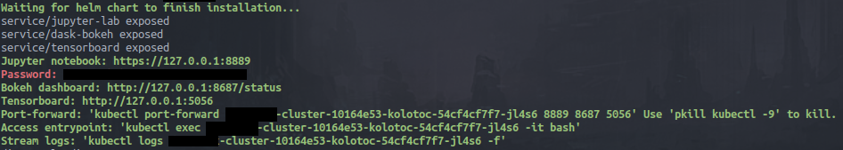

## Introduction

This chart uses the [Helm Package Manager](https://helm.sh/) to setup a Kubernetes managed cluster which deploys a distributed ring-all-reduce neural network training framework [(Horovod)](https://eng.uber.com/horovod/) alongside a flexible task scheduling system [(Dask)](https://dask.org/)

[Kolotoc](https://cs.wikipedia.org/wiki/Koloto%C4%8D) creates a [ring all-reduce](https://www.cs.fsu.edu/~xyuan/paper/09jpdc.pdf) network as Kubernetes statefulsets. Each rank in the ring-all-reduce network is referred to as a "Tower". Towers are connected to the dask network via "Sentinel" dask-workers who simply monitor the state of the machine-node during training.

Kolotoc creates a scheduler node outside of the ring-all-reduce-network as a Kubernetes deployment. The scheduler node serves as an entrypoint to the cluster and is equipped with one [dask-scheduler](https://docs.dask.org/en/latest/scheduler-overview.html), [Tensorboard](https://www.tensorflow.org/guide/summaries_and_tensorboard), [Dask Bokeh](https://distributed.dask.org/en/latest/web.html), and [Jupyter Lab](https://jupyterlab.readthedocs.io/en/stable/).

Finally, Kolotoc creates "Carriers" or machine nodes that deploy [dask-workers](https://distributed.dask.org/en/latest/worker.html) as as statefulsets equally proportional to the number of logical cores.

Some helpful commands:
* `goto tower 0` -  Go to tower zero (rank-zero)
* `goto carrier 0` -  Go to carrier zero (dask-workers on carrier zero)
* `repo checkout master`  - Switch to master branch across all machine nodes (towers and carriers)
* `repo update master` - Update the repository across all machine nodes (towers and carriers)

## Prerequisites

- Kubernetes cluster v1.8+
- Google Cloud SDK 236.0.0
- jq 1.5-1
- uuidgen-runtime 2.31.1

## Quick deployment on Google Cloud

  This repository contains `cluster.sh`, a limited convenience script to automate the startup and teardown of clusters running Kolotoc. Currently, `cluster.sh` only supports Google Cloud and is only tested on Ubuntu 18.04.

### Start Cluster

Run `./cluster.sh ---num-towers 4 num-carriers 1 --carrier-type n1-standard-4` to start a four rank ring-all-reduce network equipped with four dask-workers. You will need to authenticate via the [Google Cloud SDK](https://cloud.google.com/sdk/).

Type `./cluster.sh --help` for a list of available options:

| Parameter       | Description                 | Default |
|-----------------|-----------------------------|---------|
| `cluster-name`  | cluster  name               | `kolotoc-cluster-uuid` |
| `num-towers`    | number of ring-all-reduce ranks | `1` |
| `num-gpus`      | number of GPUs to attach per rank | `0` |
| `num-carriers`  | number of dask-worker machines | `1` |
| `carrier-type`  | dask-worker machine type | `n1-standard-4` |
| `tower-type`    | training machine type | `n1-standard-4` |

### Interacting with the Cluster

  The utility script will output several web-addresses for:
  * Tensorboard
  * JupyterLab
  * Dask Web User Interface



Use your local browser to view each application. The default password for JupyterLab is `kolotoc`

You may also interact with the cluster via the printed ```kubectl exec ... -it /bin/bash``` command. Running the command will connect you to the scheduler node.

## Manual deployment
Only read past this section if you __do not__ want to use the `cluster.sh` utility script.

### Build Docker Image

The official Horovod Dockerfile is unsupported due to its incompatibility with the Dask Dockerfile. Please use the Dockerfile provided in the base of this image as a starting point:

```bash
mkdir kolotoc-docker
wget -O kolotoc-docker/Dockerfile https://raw.githubusercontent.com/nmatare/kolotoc/master/Dockerfile?token=AD7C53PTEVX447DJOGJEFVC4Y5CGW
docker build -t kolotoc:latest kolotoc-docker
```
## Installing the Chart

```bash
$ helm install --values ~/values.yaml nmatare/kolotoc
```

## Nice-to-have future features
  - [ ] Build [MPI-ULFM2](http://fault-tolerance.org/) into the Dockerfile to support fault tolerance;
  - [ ] Add support Azure cloud to enable infiniband network interfaces (Microsoft is one of the few cloud providers
        to provide HPC supprt.
  - [ ] Enable and build Horovod/OpenMPI with [openucx](https://github.com/openucx/ucx) protocol.
  - [ ] Add the ability to scale up/down the cluster based upon workload; and
  - [ ] Refactor `cluster.sh` into a program that supports multiple cloud providers.

## Miscellaneous

This chart is based off [stable/horovod](https://github.com/helm/charts/tree/master/stable/horovod)
created by cheyang.

What's a kolotoc?
A [czech carousel](https://sk.wikipedia.org/wiki/Koloto%C4%8D) not unlike the Russian horovod dance.
